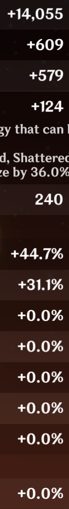

# hutaoartifacts

> Compare Hu Tao artifact stats with ocr!!!

## Usage

- download/clone repo
- install requirements
- screenshot hu tao artifact details and edit like this:

- put edited screenshots into `images`
- run main.py
- put text into something like [carbon](https://carbon.now.sh/)

## License
[MIT](https://github.com/RealCyGuy/hutaoartifacts/blob/main/LICENSE.md)
